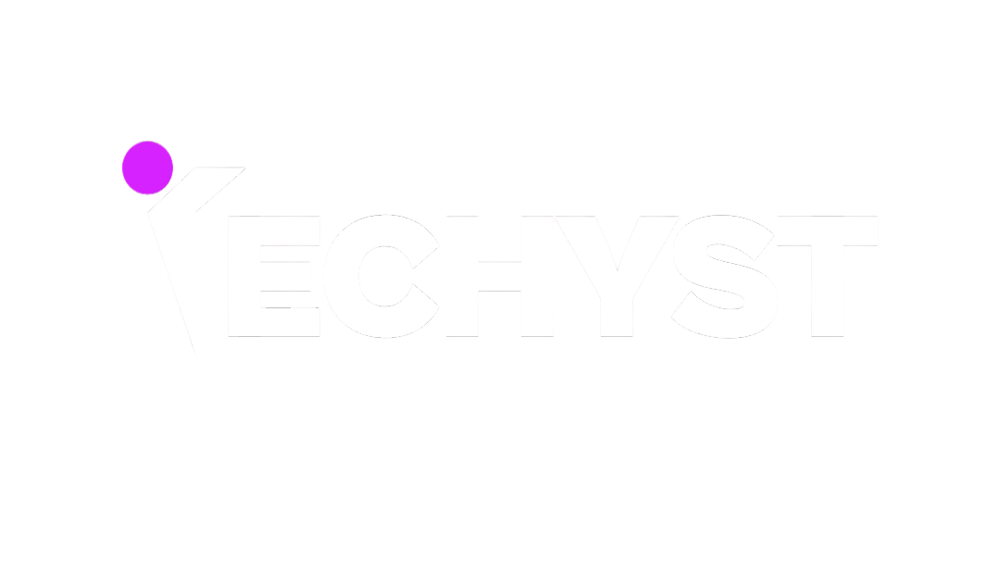
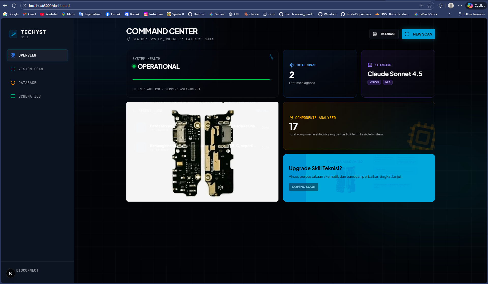
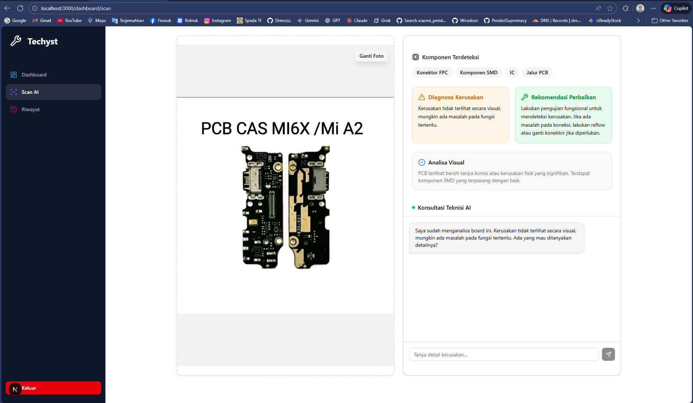
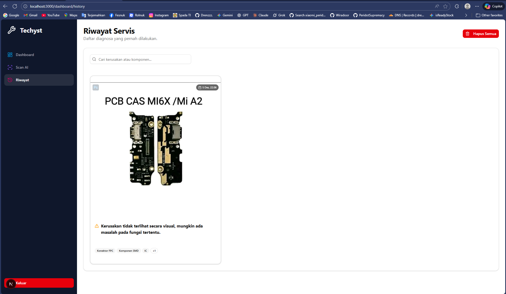

# Techyst

<div align="center">



**Mata Kedua untuk Teknisi Handphone Indonesia**

<br />

[](https://nextjs.org/)
[](https://ui.shadcn.com/)
[](https://kolosal.ai/)
[](LICENSE)

**Inovasi AI: Mendorong Usaha Lokal dengan AI Inklusif**

[🎬 Lihat Video Demo](#) · [🚀 Coba Live Demo](https://techyst.vercel.app)

<br />



</div>

<br />

## Latar Belakang Masalah

Di Indonesia, ribuan teknisi HP (UMKM) bekerja secara otodidak dengan peralatan terbatas. Tantangan terbesar mereka adalah:

1.  **Motherboard Baru:** Sulit mengenali letak komponen pada HP model terbaru yang skemanya belum tersebar.
2.  **Diagnosa Visual:** Kesulitan membedakan antara korosi mikroskopis, jalur putus, atau _short_ halus.
3.  **Keterbatasan Mentor:** Tidak punya tempat bertanya yang responsif saat mengalami kebuntuan (_stuck_).

**Techyst hadir sebagai solusi.** Aplikasi ini bertindak sebagai "Asisten Senior Digital" yang menggunakan **Advanced AI Reasoning** untuk mendiagnosa kerusakan hardware dan memandu perbaikan.

---

## Fitur Unggulan

### 1. Advanced Reasoning Engine

Kami menggunakan **Claude Sonnet 4.5** sebagai otak tunggal sistem. Model ini dipilih karena kemampuan _reasoning_ (penalaran) spasial dan logikanya yang superior, memungkinkannya menganalisa jalur PCB yang rumit dan memberikan saran perbaikan yang sangat akurat.

### 2. AI Visual Diagnosis

Upload foto mesin HP, dan AI akan secara otomatis:

- Mendeteksi komponen vital (CPU, EMMC, Power IC).
- Menganalisa kondisi fisik (Korosi, Gosong, Jalur Putus).
- Memberikan rekomendasi tindakan awal (Reball, Ganti IC, Jumper).

### 3. Privacy-First Architecture

Kami peduli pada kerahasiaan data servis teknisi.

- **Local Storage Persistence:** Semua riwayat foto dan diagnosa disimpan di browser pengguna (IndexedDB/LocalStorage).
- **No Cloud Database:** Kami tidak menyimpan foto board pelanggan Anda di server kami. Privasi 100% di tangan Anda.

---

## Arsitektur & Teknologi

Aplikasi ini dibangun dengan prinsip **Performance First** dan **Inclusive Design**.

- **Frontend:** Next.js 16 (App Router), TypeScript.
- **Styling:** Tailwind CSS v4, Shadcn UI, Framer Motion (Animasi).
- **AI Integration:** Kolosal AI SDK (Claude Sonnet 4.5).
- **Storage:** `idb-keyval` (Client-side IndexedDB wrapper).
- **Optimization:** `browser-image-compression` untuk upload hemat kuota.

---

## Galeri Screenshot

|           Halaman Scan AI (Upload)            |            Hasil Diagnosa & Chat            |
| :-------------------------------------------: | :-----------------------------------------: |
|  |  |

---

## Video Demo

<div align="center">
  <video width="100%" controls>
    <source src="public/demo/techys-demo.mp4" type="video/mp4">
    Your browser does not support the video tag.
  </video>
</div>

---

## Cara Install & Jalankan (Lokal)

Ikuti langkah ini untuk menjalankan Techyst di komputer lokal Anda.

### Prasyarat

- Node.js 18+ terinstall.
- Package manager `pnpm` (disarankan), `npm`, atau `yarn`.
- API Key dari [Kolosal.ai](https://kolosal.ai).

### Langkah Instalasi

1.  **Clone Repository**

    ```bash
    git clone https://github.com/Ambanet-Corporation/techyst.git
    cd techyst
    ```

2.  **Install Dependencies**

    ```bash
    pnpm install
    ```

3.  **Setup Environment Variables**
    Salin file `.env.example` menjadi `.env` di root folder, lalu isi API Key:

    ```env
    KOLOSAL_API_KEY=masukkan_api_key_kolosal_disini
    KOLOSAL_BASE_URL=[https://api.kolosal.ai/v1](https://api.kolosal.ai/v1)
    ```

4.  **Jalankan Server Development**

    ```bash
    pnpm dev
    ```

5.  **Buka Aplikasi**
    Akses [http://localhost:3000](http://localhost:3000) di browser Anda.

---

## ⚠️ Disclaimer

_Techyst adalah alat bantu diagnosa (Second Opinion). Hasil analisa AI memiliki kemungkinan kesalahan (hallucination). Teknisi wajib memverifikasi kerusakan menggunakan alat ukur fisik (Multitester/Oscilloscope) dan skema resmi sebelum melakukan eksekusi hardware._

---

<div align="center">
  <p>© 2025 Ambanet Corporation.  All rights reserved.</p>
</div>